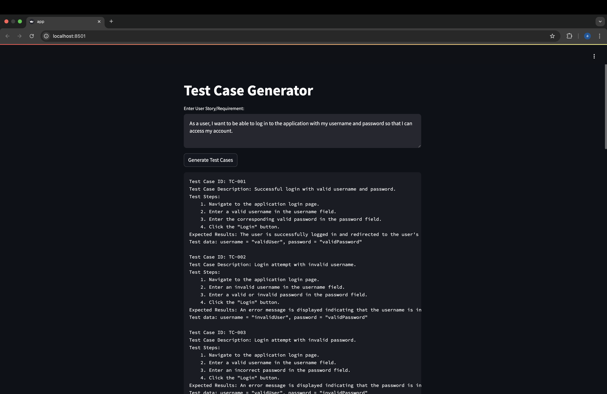

# Test Case Generator with Gemini API and Streamlit

## Overview

This project demonstrates how to use Google's Gemini API to automatically generate test cases from user stories. It uses Streamlit to create a simple web interface.

## Features

- Takes a user story as input.
- Uses the Gemini API to generate test cases.
- Displays the generated test cases in a user-friendly format.
- Handles basic error conditions.

## Getting Started

### Prerequisites

- Python 3.7 or higher
- A Google Cloud account with billing enabled
- A Gemini API key

### Installation

1.  Clone the repository:
    ```bash
    git clone https://github.com/AruneshwarAR/gemini-test-case-generator.git
    ```
2.  Create and activate a virtual environment:
    ```bash
    python -m venv venv
    source venv/bin/activate  # On macOS/Linux
    venv\Scripts\activate  # On Windows
    ```
3.  Install the required libraries:
    ```bash
    pip install streamlit google-genai
    ```
4.  Set the `GOOGLE_API_KEY` environment variable:
    ```bash
    export GOOGLE_API_KEY="your-actual-api-key"
    ```

### Running the App

```bash
streamlit run app.py
```

## Example

**Input User Story:**

```
As a user, I want to be able to log in to the application with my username and password so that I can access my account.
```

**Generated Test Cases:**


